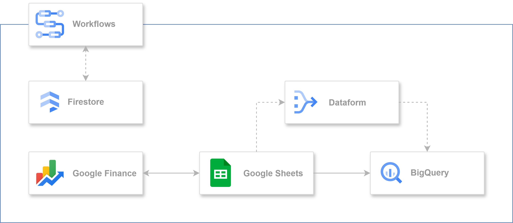

# **Financial Data Retrieval Using Google Sheets, BigQuery, Dataform, and Workflows**

## **Project Purpose**

The goal of this project is to leverage the capabilities of Google Sheets to obtain financial data for free, without relying on third-party APIs, but solely utilizing Google Finance. The project also integrates BigQuery and Dataform for data transformation, along with Google Workflows for orchestration and Google Sheets management.

## **Infrastructure Overview**

The infrastructure is built around a workflow that automates the creation and management of a Google Sheet and schedules Dataform flows. Firestore is used to store information about currency pairs and the Google Sheet, ensuring persistence and reuse of the spreadsheet id. A collection of documents in Firestore represents the currency exchange rates to be calculated.



### **Data Processing Flow**

1. **Google Sheets as a Data Source:**

   * Google Sheets is used to fetch financial data via Google Finance.
   * The sheet structure consists of four specific sheets:
     * **HIDDEN_RATES_HISTORY:** Stores the full exchange rate history.
     * **RATES_HISTORY:** A copy of the historical data without formulas to resolve reading issues.
     * **PREV_DAY_RATES:** Stores exchange rates for the previous day.
     * **CURRENT_RATES:** Holds exchange rates for the current day.

   This structure ensures that historical data is only computed once (up to yesterday), and daily updates are appended efficiently.

   The Google Sheet is created by the service account managing the workflow and is shared as read-only for all users. This ensures idempotency, as only the service account can modify the sheet, eliminating user-induced errors.
2. **Data Ingestion in BigQuery:**

   * BigQuery reads data from the Google Sheet using external tables that reference the spreadsheet.
   * This enables real-time access to updated exchange rates without requiring additional API calls.
3. **Data Transformation with Dataform:**

   * The workflow calculates the historical exchange rate for one currency pair at a time.
   * It materializes the data in BigQuery by reading from the external table in the landing dataset.
   * Using an incremental table, the processed data is stored in the **commons** dataset, where the data is fully consolidated.
   * This process is repeated for all currency pairs that have not been previously calculated.
   * At the end of the process, the workflow triggers a final step that reads only the exchange rates for yesterday and today, integrating them into the historical dataset. This ensures that even when executed daily, only a small amount of data is processed.
   * The exchange rates for today are managed as a view, combining historical data with today’s rates, since they fluctuate throughout the day and are not yet final.
4. **Workflow Orchestration with Google Workflows:**

   * A Google Workflow manages the creation and configuration of the spreadsheet.
   * It also triggers and schedules Dataform execution for continuous data updates.
   * The workflow has two execution modes:

     * **Without Parameters:** Runs with default settings.
     * **With Parameters:** Accepts two optional parameters:
       * **fullRefresh (boolean):** If true, BigQuery tables are recreated, requiring a full recalculation of historical data.
       * **recreateSpreadsheet (boolean):** If true, deletes the existing spreadsheet (if present) and creates a new one.
       * **defaultStartDate (string)**: If set, overwrites the default start date (which is set at 2015-01-01) from wich to generate the currency history rates. If a pair has its own **startDate** set in Firestore, it uses that instead.
5. **Firestore Integration**

   * Firestore is utilized to store metadata related to currency exchange processing and maintains:
     * **master_spreadsheet_id:** to ensure consistent reference across executions.
     * **currency-pairs:** collection defining which currency exchange rates need to be calculatedis is Firebase structure, where **currency-exchange** is the main database:

```
🗄️ currency-exchange
  └ 📂 configurations
    └ 📃 wf-currency-exchange
      ├ master_spreadsheet_id (string, operational)
      └ 📂 currency-pairs
        ├ 📃 USDEUR
	│ ├ status (string, operational)
        │ └ startDate (string, optional)
        └ 📃 GBPEUR
	  ├ status (string, operational)
          └ startDate (string, optional)

```

## **Efficiency and Performance Optimization**

* The structured division of sheets (HIDDEN_RATES_HISTORY, RATES_HISTORY, PREV_DAY_RATES, and CURRENT_RATES) reduces the need for redundant calculations.
* By appending new daily values instead of recomputing the entire history, the workflow remains efficient and scalable.
* Utilizing external tables in BigQuery avoids unnecessary duplication of data while ensuring real-time availability.

This approach provides a cost-effective, scalable, and automated solution for obtaining and processing financial data using Google’s ecosystem.
